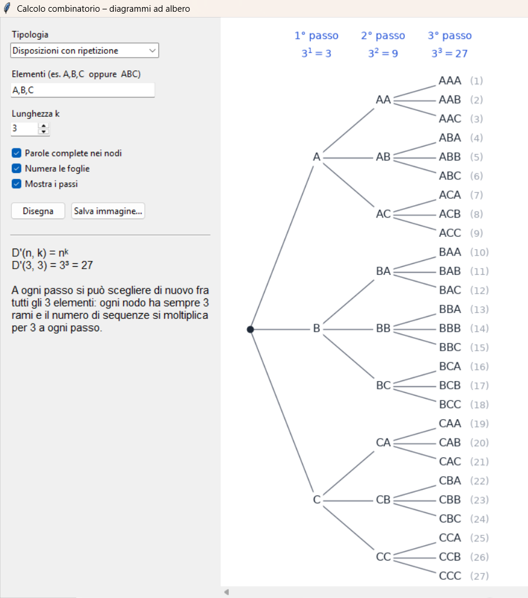

# Combinatoria

Piccola applicazione per visualizzare con diagrammi ad albero i principali raggruppamenti del calcolo combinatorio, pensata come supporto alla didattica.

Per ogni tipologia l'albero mostra, passo dopo passo, quante scelte sono possibili e quanti nodi si ottengono, così il legame con la formula risulta evidente.



| Tipologia | Formula |
|---|---|
| Disposizioni con ripetizione | D′(n, k) = nᵏ |
| Disposizioni semplici | D(n, k) = n·(n−1)·…·(n−k+1) |
| Permutazioni semplici | P(n) = n! |
| Permutazioni con ripetizione | P = n! / (k₁!·k₂!·…) |
| Combinazioni semplici | C(n, k) = D(n, k) / k! |

## Download

Scarica la versione per il tuo sistema dalla pagina **[Releases](https://github.com/ferale90/combinatoria/releases)**:

| Sistema | Pronto all'uso | Archivio compresso |
|---|---|---|
| Windows | `Combinatoria-windows.exe` | `Combinatoria-windows.zip` |
| macOS (chip Apple M1, M2, …) | `Combinatoria-macos-apple-silicon.dmg` | `Combinatoria-macos-apple-silicon.zip` |
| macOS (processore Intel) | `Combinatoria-macos-intel.dmg` | `Combinatoria-macos-intel.zip` |
| Linux | `Combinatoria-linux` | `Combinatoria-linux.tar.gz` |

I due file contengono lo stesso programma: scegli quello che preferisci. Non serve installare Python.

**macOS.** Apri il file `.dmg` e trascina Combinatoria nella cartella Applicazioni. L'app non è firmata da Apple, quindi al primo avvio viene bloccata: prova ad aprirla una volta, poi vai in *Impostazioni di Sistema → Privacy e sicurezza* e clicca **Apri comunque**. Dalla volta successiva si apre normalmente.

**Linux.** Il browser non conserva il permesso di esecuzione, quindi dopo il download va reso eseguibile: `chmod +x Combinatoria-linux`, poi `./Combinatoria-linux`. L'archivio `.tar.gz` conserva invece il permesso: basta estrarlo e avviare `Combinatoria`.

**Windows.** Alcuni antivirus possono segnalare l'eseguibile come sconosciuto: è un comportamento comune per i programmi non firmati creati con PyInstaller.

## Utilizzo

1. Scegli la tipologia.
2. Inserisci gli elementi, separati da virgole (`A,B,C`) oppure di seguito (`ABC`). Con le virgole puoi usare anche elementi di più caratteri, ad esempio `10,20,30`.
3. Imposta la lunghezza *k*. Per le permutazioni è automaticamente uguale al numero di elementi.

Accanto all'albero compaiono la formula generale, quella con i valori sostituiti e una breve spiegazione. Le opzioni permettono di nascondere le parole complete nei nodi, la numerazione delle foglie o le intestazioni dei passi, ad esempio per far completare l'albero agli studenti.

Con **Salva immagine** puoi esportare il diagramma in PDF, PNG o SVG.

Per mantenere il disegno leggibile, gli alberi con più di 500 foglie non vengono disegnati: in quel caso viene mostrata solo la formula.

## Avvio dal codice sorgente

Serve Python 3.8 o successivo con Tkinter e matplotlib.

```bash
pip install matplotlib
python combinatoria.py
```

Su Debian/Ubuntu conviene usare i pacchetti di sistema:

```bash
sudo apt install python3-tk python3-matplotlib
python3 combinatoria.py
```

Su macOS è consigliato Python installato da [python.org](https://www.python.org/downloads/), che include già Tkinter.

## Compilazione

Gli eseguibili vengono generati automaticamente con [PyInstaller](https://pyinstaller.org) tramite GitHub Actions (`.github/workflows/build.yml`) a ogni nuova release. Per compilare in locale:

```bash
pip install pyinstaller matplotlib
pyinstaller --onefile --windowed --name Combinatoria combinatoria.py
```

L'eseguibile si trova nella cartella `dist`. PyInstaller compila solo per il sistema su cui viene eseguito.

## Crediti

Sviluppato con l'aiuto di Claude (Anthropic), modello Opus 5.5.

## Licenza

Distribuito con licenza [GNU GPL v3.0](LICENSE).
